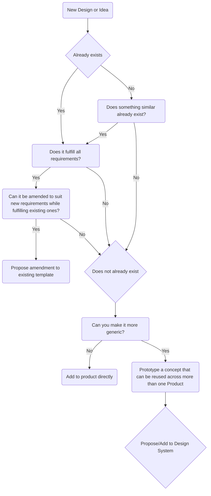

# Methodology

This design system is created using the atomic design methodology. Atomic design is a methodology composed of five distinct stages working together to create interface design systems in a more deliberate and hierarchical manner. The five stages of atomic design are:

- Atoms
- Molecules
- Organisms
- Templates
- Pages

# When to add a new component

When you are creating a new component (or anything for that matter), you can use the following flowchart:

# Sources
- [Atomic Design](https://atomicdesign.bradfrost.com/chapter-2/)
